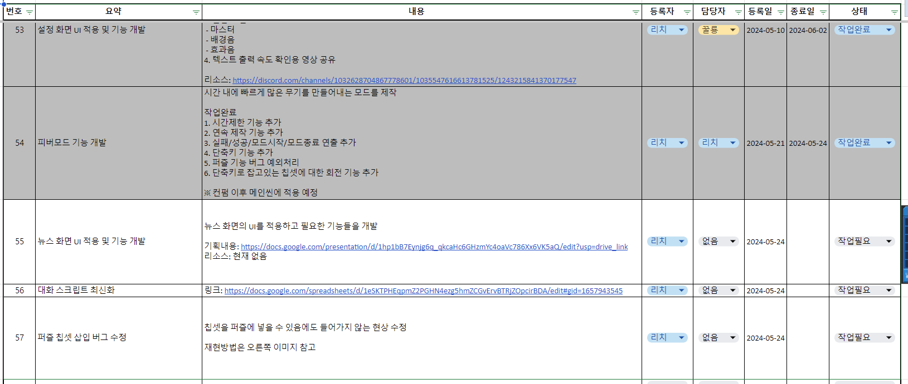
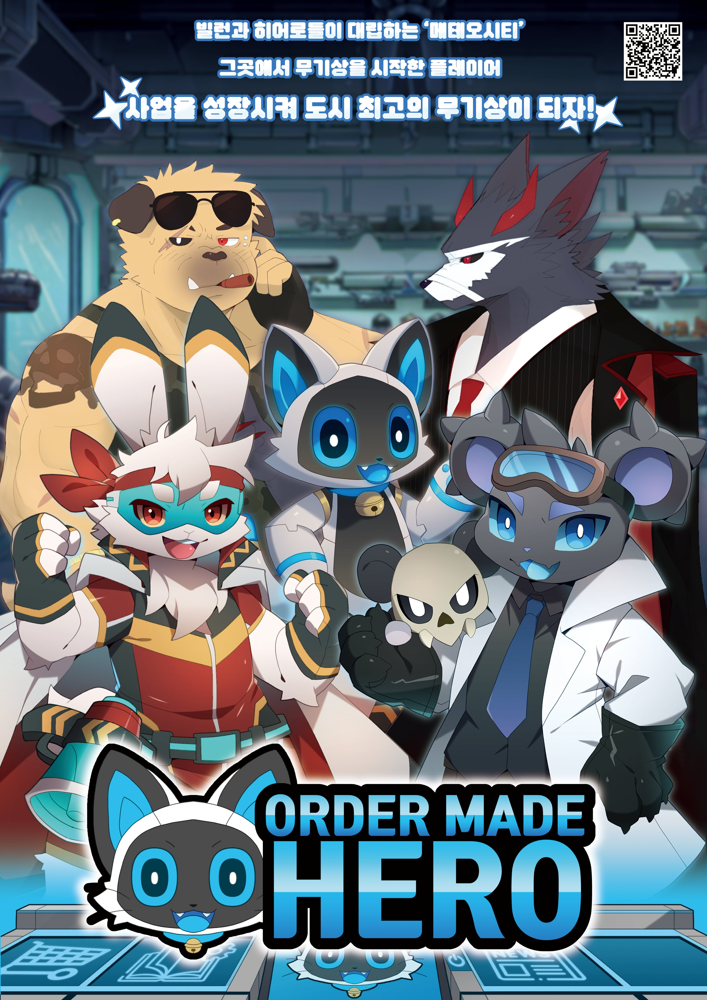
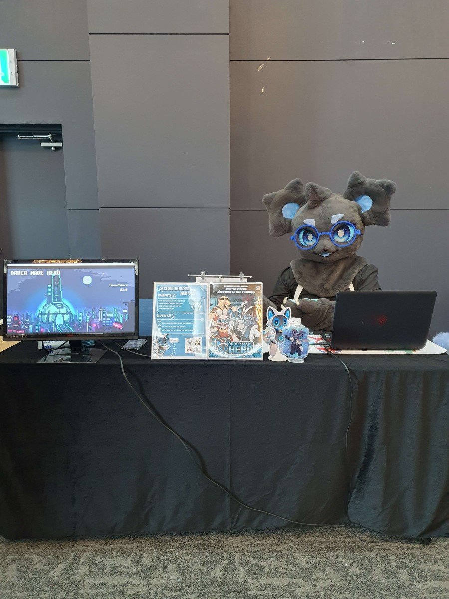
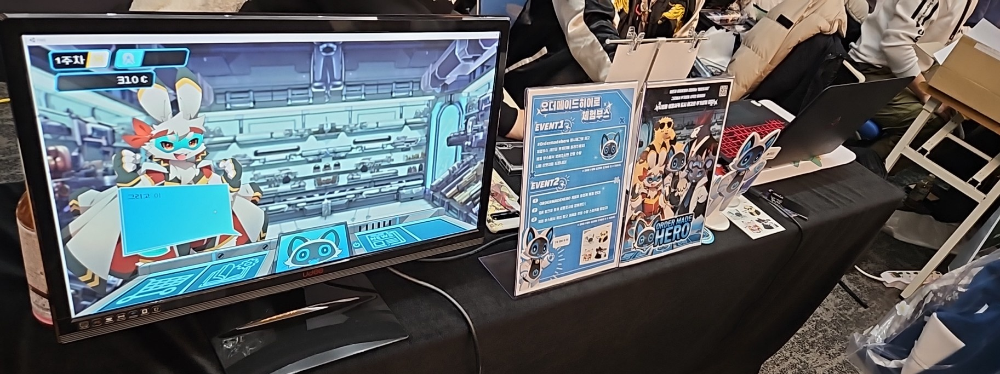

<h1>Order Made Hero</h1>

자기계발과 역량강화를 목표로 만들어진 스터디그룹에서 제작 
추후 스팀 등의 플랫폼을 통해 배포 예정 
히어로와 빌런이 대립하는 동시에 공존하는 세계에서 무기상을 하는 게임 
어떤 진영에게 좋은 무기를 만들어 주는지에 따라 스토리가 달라지는 퍼즐게임  
최근 1100명 가량의 인원이 참가한 컨벤션에서 부스를 내어 데모버전 체험시연을 하였고 피드백을 받아 개발을 진행 중  

自己啓発と力量強化を目標に作った勉強会にて開発  
今後スチームなどのプラットフォームで配布する予定  
ヒーローとヴィランが対立すると同時に共存する世界で武器屋をするゲーム  
どの陣営に良い武器を作ってくれるかでストーリーが変わるパズルゲーム   
2024年、約1100人が参加したコンベンションでブースを出してデモバージョン体験試演をし、フィードバックを受けて開発を進行中  

## 개요（概要）
- 개발기간: 2022.10.27 ~
- 사용기술: Unity, C#
- 참여자(프로그래밍): RaccoonCoder7, TUNAMAYO, LAPILA
- 담당: 팀장, 전체구조설계, 업무분배, 퍼즐 제작 기능, 대사 출력 기능, 피버모드, 특수씬 연출, 이슈트래커(프로젝트 관리 툴) 제작 등  
- 開発期間：2022年10月27日～
- 使用技術：Unity、C#
- 参加者(プログラミング)：RaccoonCoder7、 TUNAMAYO、 LAPILA
- 担当：チーム長、全体構造設計、業務分配、パズル機能を含めたほぼ全ての機能、台詞出力機能、フィーバーモード、特殊シーン演出、Issue Tracker(プロジェクト管理ツール)開発等

 

## 사진/영상 (영상은 클릭 시 유튜브로 이동 됨)
## 写真・映像（映像はクリック時YouTubeへ連結）
<b>샘플 플레이 영상（サンプルプレイ映像）</b> 

<b>피버모드(개발중)</b> 
<b>フィーバーモード(開発中)</b> 

 

<b>이슈트래커 (스프레드시트로 제작한 프로젝트 관리 툴)</b> 
<b>Issue Tracker（エクセルで開発したプロジェクト管理ツール）</b>

 

<b>포스터（ポスター）</b>

 

<b>컨벤션 체험부스 사진（コンベンションの体験ブースの写真）</b>

